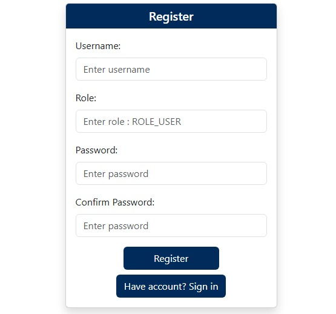
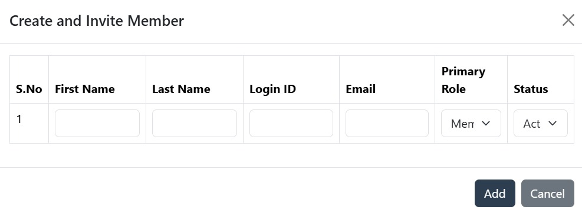
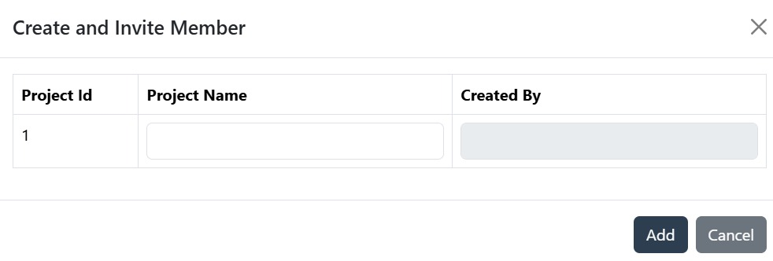
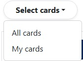
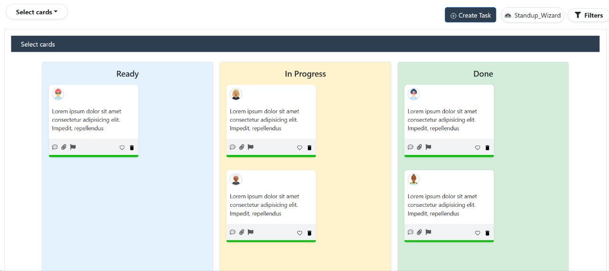
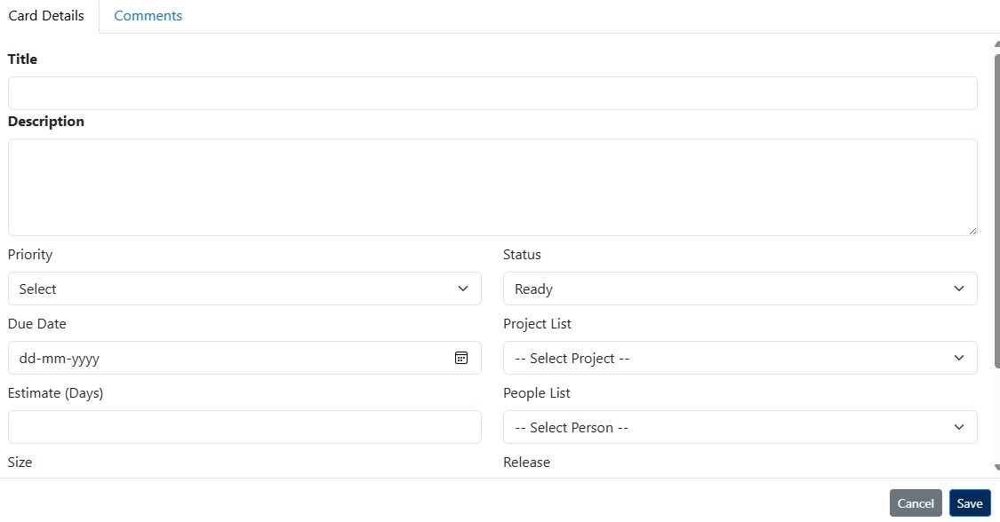
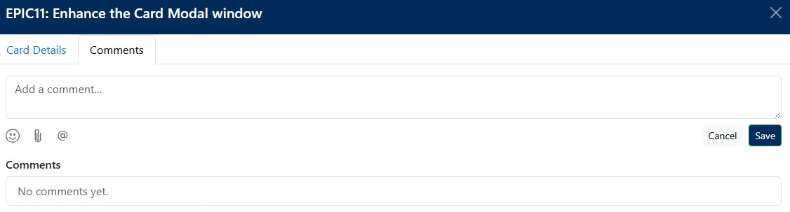
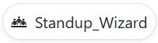
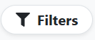

# Task-Management-Project

Steps to run the app locally:-  
 1.clone the repository git clone https://github.com/pandhivamsi/Task-Management-Project.git  
 2.npm install  
 3.npm run dev  
 4.npm start
 
UseCase Diagram:-
 

 
Models:- 

 
 
 1.User Model  
     -id: id number  
     -name: name of the user  
     -title : title of the user  
     -organization: name of the organization  
     -workPhone: phone number  
     -mobilePhone: mobile number  
     -email: user email 
     -photo: user photo  
  
 2.Card Model  
      -id:id number 
      -title: title of the card 
      -size :size of the card 
      -priority :pripority of the card 
      -dueDate:due date 
      -release:release 
      -sprint :sprint 
      -status:status of the card 
 
3.Peoples Model 
      -firstName: first name of User  
      -lastName": last name of user 
      -loginId": login id 
      -email: email 
      -primaryRole: role 
      -status: present status 
      -id: id number 
 
4.projects Model  
       id: Proejct id  
       projectName: Project Name  
 
APIs
 ---
Auth Endpoints   

Signup User(POST)  

  -/api/v1/auth/signup 
  -User can signup by adding firstName lastName, user Role and password,confoirm password.  

Signin User(POST)  

 -/api/v1/auth/signup 
 -User can signin with userNmae and password.  

User Endpoints  

User Details(GET)  

 -/api/v1/users/getDetails/:userId (where userId is the path variable) 
 -To fetch the details of the user.  

Login Page:- 
 
 
	This is a user login form.its lets users sign in to an app or website using their username and password.   
  ->How It Works  
	  -At the top, "User Login" tells users what to do. 
  ->There are two input boxes: 
	  -The first one is for entering a username. 
	  -The second one is for entering a password. 
  ->There are two buttons: 
	 -The "Login" button is for users to sign in if they already have an account. 
	 -The "New? Register" button is for new users who want to create an account.  
 
 
Registration Page:- 
  
	-This is a registration form for creating a new account in an app or website. 
  ->What Each Field Means:-  
	  -The title "Register" lets users know they are signing up. 
	  -Username: Type a username for the new account. 
	  -Role: Enter a role, like "ROLE_USER," which decides user access level. 
	  -Password: Type a password for security. 
	  -Confirm Password: Type the same password again to make sure there are no  mistakes. 
  ->Buttons:- 
	  -"Register" submits the form to create an account. 
	  -"Have account? Sign in" lets users go back to the login page if they already have an account. 
    This helps new users sign up safely and easily for the service. 
     
Header :- 
  1.Select Project:- 
     
   -When you click the Select Project button, a dropdown appears with an option to Add Project. 
   -Clicking on it opens a form where you can enter the Project Name. 
   -Finally, you can save it by clicking the Save Project button. 
  2.Profile icon:- 
    
   -When you click the profile icon, a dropdown menu opens. 
   -It shows options like Edit Details, Reset Password, choose a theme color (using the color dots), and Log Out. 
   -This menu is simply for quickly accessing profile-related actions.  
  3.ThreeDots icon:- 
     
   -When you click the three dots icon, a menu panel opens. 
   -It shows options like Peoples and Projects. 
   -This lets you quickly switch between managing people and managing projects. 
     ->Peoples :- 
       
       -When you click the Peoples button, a popup form appears. 
       -Here you can enter details like First Name, Last Name, Login ID, Email, Role, and Status. 
       -Finally, you can add the member or cancel the action. 
     ->Projects :- 
       
      -When you click the Projects button, a popup form appears. 
      -It allows you to enter the Project Name, while fields like Project Id and Created By are shown automatically. 
      -You can then choose to add the project or cancel the action. 
  4.Search icon:- 
    
   -When you click the search icon, a text box appears. 
   -Here you can type keywords to search for items quickly. 
  5.Support icon:- 
     
    -When you click the Support icon, a scheduling window opens. 
    -It shows an option to book a 30-minute meeting. 
    -You can select a date and time from the calendar. 
    -After confirmation, the web conferencing details will be shared. 
    -This helps you easily schedule a support call online. 
 
Select Cards:- 
  
 All cards :- 
	-Everyone’s tasks 
 My cards :- 
	-Only my tasks  

Dashboard:-  
  
Dashboard page:  
  -Top Bar – Options like Select cards, Create Task, Standup_Wizard, and  Filters  are available. 
  -Task Board – It is divided into three columns: Ready, In Progress, and Done. 
  -Cards – Each card shows a small profile icon, description text, and task details. 
  -Card Actions – Icons at the bottom of each card allow you to comment, edit, flag, favorite, or delete tasks. 
  -Color Sections – Columns have different background colors (blue for Ready, yellow for In Progress, green for Done). 
  -Multiple Tasks – You can track several tasks under each status column. 
  -Purpose – The dashboard helps manage tasks visually like a Kanban board. 
 
Create Task:- 
  1. Card Details Tab:- 
   
	-This is where you enter all the task information. 
    ->Fields include:- 
	-Title & Description → Name and details of the task. 
	-Priority & Status → Select task urgency and current progress stage. 
	-Due Date & Estimate (Days) → Set deadline and time estimation. 
	-Project List & People List → Assign task to a project and person. 
	-Size & Release → Additional classification of the task. 
      Basically, this tab is used to create or edit the task details. 
 
2. Comments Tab:- 
    
    -This tab is for communication and collaboration. 
   ->You (or team members) can: 
      -Add comments about the task. 
      -Mention people (using @). 
      -Attach files/images. 
      -Use emojis for quick reactions. 
     A list of all saved comments appears below for tracking discussions. 
      
3.Standup_Wizard 
 
    - When you click the Standup_Wizard, the dashboard expands into full screen. 
    - In the Standup_Wizard, the "Start" button at the top left is a timer. It turns on when we click on the user profile. 
    - It displays three columns: Ready, In Progress, and Done. 
    - Each column contains task cards with user icons and details. 
    - The cards include options like comment, edit, flag, favorite, and delete. 
    - This view helps track tasks easily in a clean, organized layout. 
 
4.Fiter 
   
   
   
   -In the filter 
   
    - This is a filter panel to refine or organize the displayed data. 
    - Clear Filters lets you remove all applied filters. 
    - Categories available are Department, Role, and Priority. 
    - Selecting a category will show related filter options on the right side. 
    - Cancel closes the panel without saving any changes. 
    - Save applies the chosen filters to the main page. 
    - It helps quickly locate specific items by limiting the view to selected criteria. 

     

